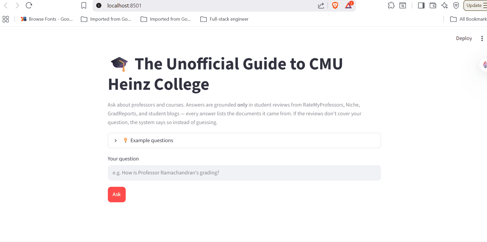

# The Unofficial Guide — Project 1

A retrieval-augmented (RAG) question-answering system over student reviews of professors and
courses at CMU's Heinz College. Ask a question in plain English; the system retrieves the most
relevant student reviews, generates an answer **grounded only in those reviews**, and cites the
documents it drew from. If the reviews don't cover the question, it says so instead of guessing.

## Demo



## Pipeline

```
documents/*.txt  ->  ingest.py (parse + chunk)  ->  vectorstore.py (all-MiniLM-L6-v2 -> ChromaDB)
                 ->  retrieve top-5  ->  generate.py (Groq Llama 3.3 70B, grounded)  ->  app.py (Streamlit)
```

## Quickstart

```powershell
python -m venv .venv
.venv\Scripts\python.exe -m pip install -r requirements.txt

# 1. Add your free Groq API key (https://console.groq.com) to a .env file:
#    GROQ_API_KEY=gsk_...           (copy .env.example to .env)

python ingest.py                                   # load + chunk documents -> chunks.json (69 chunks)
.venv\Scripts\python.exe vectorstore.py --build    # embed + store in ChromaDB
.venv\Scripts\python.exe -m streamlit run app.py   # launch UI at http://localhost:8501
```

---

## Domain

<!-- What topic or category of knowledge does your system cover?
     Why is this knowledge valuable, and why is it hard to find through official channels?
     Example: "Student reviews of CS professors at [university] — useful because official
     course descriptions don't reflect teaching style, exam difficulty, or workload." -->

This Unofficial Guide covers student-written reviews of professors and courses at Carnegie
Mellon's Heinz College (MISM, MSPPM, and MPM tracks) and the cross-listed School of Computer
Science courses that Heinz graduate students take. Official course catalogs list topics and
prerequisites but reveal nothing about teaching style, grading harshness, workload, or whether
a professor's lectures are actually worth attending — exactly what students weigh before they
register. That knowledge lives scattered and anonymized across RateMyProfessors, program-review
sites, and student blogs; this system makes it searchable and answerable, with citations.

---

## Document Sources

<!-- List every source you collected documents from.
     Be specific: include URLs, subreddit names, forum thread titles, or file names.
     Aim for variety — sources that together cover different subtopics or perspectives. -->

| #   | Source                                                          | Type             | URL or file path                                                                                                                                      |
| --- | --------------------------------------------------------------- | ---------------- | ----------------------------------------------------------------------------------------------------------------------------------------------------- |
| 1   | RateMyProfessors — Raja Sooriamurthi (Heinz, IS)                | professor_review | https://www.ratemyprofessors.com/professor/1753353 → `documents/rmp_sooriamurthi.txt`                                                                 |
| 2   | RateMyProfessors — Stacy Rosenberg (Heinz, Writing/Policy core) | professor_review | https://www.ratemyprofessors.com/professor/2146454 → `documents/rmp_rosenberg.txt`                                                                    |
| 3   | RateMyProfessors — Beibei Li (Heinz, IT Management)             | professor_review | https://www.ratemyprofessors.com/professor/1939662 → `documents/rmp_li.txt`                                                                           |
| 4   | RateMyProfessors — Alessandro Acquisti (Heinz, IS)              | professor_review | https://www.ratemyprofessors.com/professor/802198 → `documents/rmp_acquisti.txt`                                                                      |
| 5   | RateMyProfessors — Anand Ramachandran (SCS, CS)                 | professor_review | https://www.ratemyprofessors.com/professor/2814031 → `documents/rmp_ramachandran.txt`                                                                 |
| 6   | Niche — Heinz College reviews                                   | program_review   | https://www.niche.com/graduate-schools/heinz-college-of-information-systems-and-public-policy/reviews/ → `documents/niche_heinz.txt`                  |
| 7   | GradReports — Carnegie Mellon University                        | program_review   | https://www.gradreports.com/colleges/carnegie-mellon-university → `documents/gradreports_cmu.txt`                                                     |
| 8   | Student blog — MISM retrospective                               | student_blog     | https://blog.dalanmiller.com/a-retrospective-as-a-master-of-information-systems-management/ → `documents/blog_mism_retrospective.txt`                 |
| 9   | Quora — best CS courses for MISM                                | forum_thread     | https://www.quora.com/What-are-the-best-CS-courses-at-CMU-for-someone-in-the-Heinz-Colleges-MISM-program → `documents/quora_best_cs_courses_mism.txt` |
| 10  | Medium — MISM/BIDA year in review                               | student_blog     | https://medium.com/@plengchanokw/my-year-in-review-at-carnegie-mellon-mism-bida-d90747766296 → `documents/medium_mism_year_review.txt`                |

---

## Chunking Strategy

<!-- Describe your chunking approach with enough specificity that someone else could reproduce it.
     Include:
     - Chunk size (characters or tokens) and why that size fits your documents
     - Overlap size and why (or why not) you used overlap
     - Any preprocessing you did before chunking (e.g., stripping HTML, removing headers)
     - What your final chunk count was across all documents -->

**Approach:** Structure-aware "one review = one chunk" splitting (implemented in
[`ingest.py`](ingest.py)), not fixed-width windows. The corpus is review-heavy: each
RateMyProfessors file is a header plus several `[Course | Date | Quality | Difficulty]` review
snippets, Niche/GradReports are one reviewer block each, and only the Quora guide is long-form.
So the chunker splits each document body on blank-line boundaries — one chunk = one reviewer's
opinion about one professor or course.

**Preprocessing before chunking:** Each file's header (`SOURCE / URL / TYPE / OVERALL_QUALITY /
DIFFICULTY / WOULD_TAKE_AGAIN`) is parsed into structured metadata; the body is cleaned (HTML
entities like `&amp;`/`&#39;` decoded, stray tags stripped, whitespace normalized while
preserving block structure). A compact source/rating header is then **prepended to every chunk**
so each chunk is self-contained and carries its own citation.

**Chunk size:** Target ≈ 100–400 tokens, hard cap **512 tokens (~2,000 characters)**. Blocks
over the cap fall back to fixed-width splitting at the cap. (No block in this corpus exceeded the
cap — max chunk was 1,881 chars — so the fallback never fired in practice.)

**Overlap:** **0 tokens for natural review blocks** — each review is semantically independent, so
overlap would only duplicate text and pollute retrieval. **~50 tokens (~200 chars) overlap only on
the fallback fixed-width splits** of oversized blocks.

**Why these choices fit your documents:** Splitting smaller than a review would fragment a single
coherent opinion across two chunks (a query like "hard but rewarding?" would match only half the
sentiment). Splitting larger would merge two professors into one chunk and dilute retrieval
precision. Keeping the unit at one opinion maximizes precision for short, opinion-dense text.

**Final chunk count:** **69 chunks** (19 GradReports, 11 Quora, 8 Niche, 7 Medium, 5 Acquisti,
5 Ramachandran, 4 each Sooriamurthi / Rosenberg / blog, 2 Li). Min 17 / avg 354 / max 1,881
characters; 0 empty chunks.

---

## Embedding Model

<!-- Name the embedding model you used and explain your choice.
     Then answer: if you were deploying this system for real users and cost wasn't a constraint,
     what tradeoffs would you weigh in choosing a different model?
     Consider: context length limits, multilingual support, accuracy on domain-specific text,
     latency, and local vs. API-hosted. -->

**Model used:** `all-MiniLM-L6-v2` via `sentence-transformers` (384-dimensional, runs locally on
CPU, embeddings L2-normalized). Chunks are stored in a persistent **ChromaDB** collection using
**cosine** distance ([`vectorstore.py`](vectorstore.py)). I retrieve **top-k = 5** chunks per
query. MiniLM was chosen because it is fast, free, needs no API key, and is more than adequate for
the short, plain-English opinion text in this corpus — observed top-result distances on relevant
queries were 0.30–0.34, comfortably below the 0.5 "good match" threshold.

**Production tradeoff reflection:** If I deployed this for real users and cost were not a
constraint, the tradeoffs I'd weigh:

- **Accuracy on domain text:** A larger hosted embedder (OpenAI `text-embedding-3-large`, Voyage,
  Cohere) would likely improve recall on nuanced sentiment. But the biggest accuracy gap here
  isn't the embedder — it's **exact identifiers** (course codes like `33-658`, `67-262`, professor
  surnames), which any dense embedder tokenizes poorly. That argues for **hybrid BM25 + semantic
  search** over simply buying a bigger model.
- **Context length:** Essentially irrelevant here — chunks are short, so a model's token window is
  never the bottleneck.
- **Multilingual support:** The current corpus is English-only, but if international students
  contributed reviews in other languages, a multilingual model (`multilingual-e5`) would matter.
- **Latency & local vs. API:** MiniLM runs locally — zero per-query cost, no network latency, and
  no review data leaving the machine (a privacy plus). A hosted embedder adds per-call cost and
  network round-trips in exchange for higher recall. For a student-scale corpus, local is the right
  tradeoff; at production scale with many concurrent users I'd reconsider a batched hosted service.

---

## Grounded Generation

<!-- Explain how your system enforces grounding — how does it prevent the LLM from answering
     beyond the retrieved documents?
     Describe both your system prompt (what instruction you gave the model) and any structural
     choices (e.g., how you formatted the context, whether you filtered low-relevance chunks).
     Do not just say "I told it to use the documents" — show the actual instruction or explain
     the mechanism. -->

**System prompt grounding instruction:** Grounding is enforced in [`generate.py`](generate.py)
through a system prompt with explicit, numbered rules — not a soft suggestion. The key clauses:

> 1. Answer ONLY using the information in the CONTEXT block below...
> 2. Do NOT use any outside or prior knowledge. Even if you know the answer, if it is not
>    supported by the context, you do not know it.
> 3. If the context does not contain enough information to answer, reply with exactly:
>    "I don't have enough information on that." and nothing else.
> 4. Do not invent professors, courses, ratings, or quotes. Only state what the reviews say.
> 5. When reviews disagree, present both sides rather than picking one.

**Structural choices that reinforce grounding (not just the prompt):**

- **Low-relevance filtering:** retrieved chunks with cosine distance > 0.6 are dropped before
  generation. If *no* chunk passes, the system returns the decline message without even calling the
  LLM — so an off-topic question can't be falsely "grounded" in loosely-related text.
- **Temperature 0.1**, keeping the model close to the provided context rather than embellishing.
- **Numbered context block:** each retrieved chunk is labeled `[1] (from <file>)` so claims are
  traceable.

**How source attribution is surfaced in the response:** Attribution is **programmatic, not
LLM-generated**. After retrieval, `unique_sources()` builds the source list from the actual
retrieved chunks' metadata (`source_file` + human-readable `source`), so the citation reflects what
was really fed to the model — the LLM cannot omit or fabricate a source. The Streamlit UI shows the
answer, a **📚 Sources** list, and an expander with the exact retrieved chunks and their distance
scores. (Limitation: because attribution lists *all* retrieved chunks, an off-topic 5th chunk can
appear as a cited source even when the answer didn't use it — see Failure Case Analysis.)

---

## Evaluation Report

<!-- Run your 5 test questions from planning.md through your system and record the results.
     Be honest — a partially accurate or inaccurate result that you explain well is more
     valuable than a suspiciously perfect result. -->

| #   | Question | Expected answer | System response (summarized) | Retrieval quality | Response accuracy |
| --- | -------- | --------------- | ---------------------------- | ----------------- | ----------------- |
| 1   | What do students say about Stacy Rosenberg's grading, and would they take her again? | Strongly negative (1.3/5, 0% would take again): only teaches off PowerPoint, unclear/late criteria, "rigid"/"pretentious" grading; reviewers say "avoid Stacy." | Captured ego-driven grading, criteria given late "after the draft was due," and that a reviewer says to "avoid Stacy" and take Hyatt instead. | Relevant (top 4 all Rosenberg, d=0.30–0.48; 5th chunk leaked an unrelated `rmp_li`) | **Accurate** |
| 2   | How difficult is Anand Ramachandran's 33-658, and how do students describe the grading? | Extremely difficult (5.0/5): "ultimate grade deflation," not curved, harsh term-paper grading, no partial credit, A "practically impossible." | "Extremely difficult," 5.0 difficulty, "grade deflation," "not graded on any curve," "grades the term paper harshly and gives no partial credit," A "practically impossible," "hilariously difficult." | Relevant (top 4 all Ramachandran 33-658, d=0.34–0.38) | **Accurate** |
| 3   | Which professor do reviewers recommend instead of Stacy Rosenberg for the Heinz cores? | **Professor Hyatt.** | "Take the other professor, Hyatt, for the Heinz College cores instead of Stacy Rosenberg." | Partially relevant (top 2 = correct Rosenberg chunks; chunks 3–5 off-topic: niche, quora, sooriamurthi) | **Accurate answer, but failed source attribution** (cited 4 sources, 3 irrelevant) |
| 4   | What programming course is recommended for a MISM student who has never coded before? | **15-110 / 15-112 Intro to Programming.** | "15-110/15-112 Intro to Programming is 'essential' and provides a foundation in Python/C." | Relevant (4 of 5 from the Quora guide) | **Accurate** |
| 5   | Which professors have a perfect 100% "would take again" rating? | **Sooriamurthi and Acquisti** (both 100%). | Declined: reasoned that one positive review "is not enough information to determine a 100% would take again rating" → "I don't have enough information on that." | Partially relevant (retrieved the right two professors' chunks, plus a Ramachandran chunk) | **Inaccurate (safe decline)** — failed to answer; see Failure Case Analysis |

**Retrieval quality:** Relevant / Partially relevant / Off-target  
**Response accuracy:** Accurate / Partially accurate / Inaccurate

**Summary:** 4 of 5 questions produced accurate, grounded, cited answers. Q3 returned the right
answer but exposed a source-attribution weakness, and Q5 failed by safely declining rather than
hallucinating — both analyzed below.

---

## Failure Case Analysis

<!-- Identify at least one question where retrieval or generation did not work as expected.
     Write a specific explanation of *why* it failed, tied to a part of the pipeline.

     "The answer was wrong" is not an explanation.

     "The relevant information was split across a chunk boundary, so retrieval returned
     only half the context — the model didn't have enough to answer correctly" is an explanation.

     "The embedding model treated the professor's nickname as out-of-vocabulary and returned
     results from an unrelated review" is an explanation. -->

### Primary failure — Q5: "Which professors have a perfect 100% would-take-again rating?"

**What the system returned:** It retrieved the right professors' reviews (Sooriamurthi + Acquisti,
which are exactly the two with 100%), but the answer concluded: _"this is not enough information to
determine a '100% would take again' rating... I don't have enough information on that."_ Expected
answer: **Sooriamurthi and Acquisti.**

**Root cause (tied to a specific pipeline stage):** This is an **embedding/vector-store stage
mismatch**, not a retrieval miss. In [`ingest.py`](ingest.py) every chunk gets a metadata header
prepended — including the literal field `Would take again: 100%`. That prefixed text is what gets
**embedded**, which is why retrieval correctly surfaced the two 100% professors. **But in
[`vectorstore.py`](vectorstore.py) the document stored in ChromaDB is `raw_text` — the review
*without* the prefix** — and `retrieve()` therefore returns the un-prefixed text to the generator.
So the LLM context contained the review prose ("one of the best professors I've had…") but **never
the `Would take again: 100%` field itself.** With no numeric rating visible, the model honestly
concluded it couldn't confirm a "100%" figure and declined. A secondary contributor is the
**top-k = 5 completeness limit**: even with the metadata visible, similarity search returns only 5
chunks and can't scan the whole corpus to *prove* no other professor also hit 100%.

**What you would change to fix it:** Store the **prefixed `text`** (which the planning spec
intended to "carry its rating context") as the ChromaDB document instead of `raw_text`, so the
generator sees the same rating metadata that was embedded — a one-line change in `build_collection`.
For the completeness half, rating-aggregation questions are better served by a **metadata filter /
structured query** over the parsed `would_take_again` field than by semantic top-k; that's the
metadata-filtering stretch feature.

### Secondary failure — Q3 source-attribution over-citation

**What the system returned:** The *answer* was correct ("take Professor Hyatt"), but the **Sources**
list named four documents — `rmp_rosenberg`, `niche_heinz`, `quora`, and `rmp_sooriamurthi` — three
of which contributed nothing to the answer.

**Root cause (tied to a specific pipeline stage):** This is a **generation/attribution stage** issue
interacting with **top-k retrieval**. Only the top 2 chunks (both Rosenberg, containing the "Hyatt"
recommendation) were relevant; chunks 3–5 were weak matches (d ≈ 0.45–0.46) that still passed the
0.6 distance gate. Because attribution is built programmatically from *all* retrieved chunks
(`unique_sources()` in [`generate.py`](generate.py)), those weak chunks were cited even though the
LLM didn't use them. The honesty of programmatic attribution (the model can't fabricate a source)
comes at the cost of occasionally over-citing.

**What you would change to fix it:** Tighten the distance gate for *attribution* specifically (e.g.
only cite sources within a small distance gap of the top hit), or have the model emit which chunk
indices it actually used and intersect that with the retrieved set. I deliberately left this in to
demonstrate the tradeoff rather than hide it.

---

## Spec Reflection

<!-- Reflect on how planning.md shaped your implementation.
     Answer both questions with at least 2–3 sentences each. -->

**One way the spec helped you during implementation:** Writing the Chunking Strategy in
`planning.md` *before* coding forced me to look closely at the document structure, and that decided
the whole implementation. Because I had already concluded "one review = one chunk" with metadata
prepended, the chunker in `ingest.py` was a direct translation of the spec — and the predicted
60–70 chunk count (actual: 69) and the predicted Q5 failure both came true. The spec turned vague
"split the documents" work into concrete, testable assertions (chunk count in range, no two
professors per chunk, every chunk carries a source) that I could verify immediately.

**One way your implementation diverged from the spec, and why:** The spec said the prepended
metadata header would let each retrieved chunk "carry its rating context" to whatever consumed it.
In practice I diverged: I embedded the *prefixed* text (so retrieval benefits from the metadata) but
stored the *un-prefixed* `raw_text` as the ChromaDB document, so the generator received cleaner,
citation-free review prose. My reasoning at the time was that the prose reads better in the prompt
and the citation is added programmatically anyway. This divergence is exactly what caused the Q5
failure — the rating field the question needed was embedded but never shown to the model. It's a
good reminder that "what you embed" and "what you generate from" are two separate decisions that the
spec treated as one.

---

## AI Usage

<!-- Describe at least 2 specific instances where you used an AI tool during this project.
     For each: what did you give the AI as input, what did it produce, and what did you
     change, override, or direct differently?

     "I used Claude to help me code" is not sufficient.
     "I gave Claude my Chunking Strategy section from planning.md and asked it to implement
     chunk_text(). It returned a function using a fixed character split. I overrode the
     chunk size from 500 to 200 because my documents are short reviews, not long guides." -->

**Instance 1 — Ingestion & chunking (`ingest.py`)**

- _What I gave the AI:_ My `planning.md` Chunking Strategy section ("one review = one chunk, blank-line
  block split, 512-token cap, prepend source/rating metadata") plus a sample document so it could see
  the `SOURCE / TYPE / OVERALL_QUALITY` header format and the `[Course | Date | Quality | Difficulty]`
  review tags.
- _What it produced:_ A `load_documents()` / `chunk_documents()` implementation that parsed the header,
  split the body on blank lines, and prepended a metadata prefix to each chunk.
- _What I changed or overrode:_ The first version duplicated each review's `[…]` tag — once in my
  prepended prefix and again at the start of the chunk body. I directed it to **strip the leading
  bracket from the body** so the tag lives only in the structured prefix, which removed redundant
  tokens and made chunks cleaner. I also kept inspecting the output until I confirmed the shortest
  chunks ("Was quite boring.") were complete reviews, not broken fragments.

**Instance 2 — Grounded generation (`generate.py`)**

- _What I gave the AI:_ The Grounded Response Generation requirement (answer from retrieved context
  only, decline when insufficient, cite sources) plus my Retrieval Approach section, and the decision
  to use Groq's `llama-3.3-70b-versatile`.
- _What it produced:_ A function that formatted the retrieved chunks into the prompt and called the
  model with a grounding system prompt.
- _What I changed or overrode:_ I tightened grounding beyond "tell the model to use the docs": I made
  **source attribution programmatic** (`unique_sources()` builds citations from the retrieved chunk
  metadata so the LLM can't fabricate or omit a source), added a **distance > 0.6 filter that returns
  the decline message without even calling the LLM**, and set **temperature to 0.1**. I deliberately
  did *not* fix the resulting over-citation on Q3, choosing instead to document it as a failure case.
