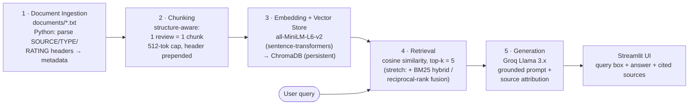

# Project 1 Planning: The Unofficial Guide

> Write this document before you write any pipeline code.
> Your spec and architecture diagram are what you'll use to direct AI tools (Claude, Copilot, etc.) to generate your implementation — the more specific they are, the more useful the generated code will be.
> Update the Retrieval Approach and Chunking Strategy sections if you change your approach during implementation.
> Update this file before starting any stretch features.

---

## Domain

<!-- What domain did you choose? Why is this knowledge valuable and hard to find through official channels? -->

This Unofficial Guide covers student-written reviews of professors and courses at Carnegie
Mellon's Heinz College (MISM, MSPPM, and MPM tracks) and the cross-listed School of Computer
Science courses that Heinz graduate students take. Official course catalogs list topics and
prerequisites but reveal nothing about teaching style, grading harshness, workload, or whether
a professor's lectures are actually worth attending — exactly what students weigh before they
register. That knowledge lives scattered and anonymized across RateMyProfessors, program-review
sites, and student blogs; this system makes it searchable and answerable, with citations.

---

## Documents

<!-- List your specific sources: URLs, subreddit names, forum threads, or file descriptions.
     Aim for at least 10 sources that together cover different subtopics or perspectives within your domain. -->

| # | Source | Description | URL or location |
|---|--------|-------------|-----------------|
| 1 | RateMyProfessors | Raja Sooriamurthi (Heinz, Information Systems) — 4 reviews, 4.8/5, positive | `documents/rmp_sooriamurthi.txt` |
| 2 | RateMyProfessors | Stacy Rosenberg (Heinz, Writing/Policy core) — 4 reviews, 1.3/5, very negative | `documents/rmp_rosenberg.txt` |
| 3 | RateMyProfessors | Beibei Li (Heinz, IT Management) — 2 reviews, 2.3/5, negative | `documents/rmp_li.txt` |
| 4 | RateMyProfessors | Alessandro Acquisti (Heinz, Information Systems) — 5 reviews, 4.7/5, positive | `documents/rmp_acquisti.txt` |
| 5 | RateMyProfessors | Anand Ramachandran (SCS, Computer Science) — 5 reviews, 2.3/5, brutal grader | `documents/rmp_ramachandran.txt` |
| 6 | Niche | Heinz College program reviews — 8 MPM/policy student reviews | `documents/niche_heinz.txt` |
| 7 | GradReports | Carnegie Mellon alumni reviews — 20 program reviews | `documents/gradreports_cmu.txt` |
| 8 | Student blog (dalanmiller.com) | MISM grad retrospective — program, workload, career services | `documents/blog_mism_retrospective.txt` |
| 9 | Quora | "Best CS courses for a MISM student" course guide (contains some factual errors — kept intentionally) | `documents/quora_best_cs_courses_mism.txt` |
| 10 | Medium (@plengchanokw) | MISM/BIDA year-in-review — 5 named-professor course reviews | `documents/medium_mism_year_review.txt` |

---

## Chunking Strategy

<!-- How will you split documents into chunks?
     State your chunk size (in tokens or characters), overlap size, and explain why those
     numbers fit the structure of your documents.
     A review-heavy corpus warrants different chunking than a long FAQ. -->

**Approach: structure-aware "one opinion = one chunk" splitting (not fixed-width).**

My corpus is review-heavy. Almost every document is a list of discrete, self-contained
opinion blocks: each RateMyProfessors file is a header plus several `[Course | Date | Quality |
Difficulty]` review snippets (1–4 sentences each); Niche and GradReports are one bracketed
reviewer block each; the two blogs are short labeled sections; only the Quora course guide is
long-form. The natural retrieval unit is therefore a single review/opinion, not an arbitrary
character window. The chunker splits each document on its block boundaries (the bracketed
review markers / blank-line-separated paragraphs) so that one chunk = one reviewer's opinion
about one professor or course.

**Chunk size:** Target ≈ 100–400 tokens per chunk, with a hard cap of **512 tokens
(~2,000 characters)**. Most review blocks fall well under the cap and become a single chunk.
Any block that exceeds the cap — the long GradReports reviews and the grouped sections of the
Quora guide — falls back to a fixed-width split at the cap.

**Overlap:** **0 tokens for natural review blocks** (each review is semantically independent —
an opinion about Prof. Acquisti does not bleed into the next reviewer's opinion, so overlap
would only duplicate text and pollute results). **~50 tokens (~10–15%) overlap only on the
fallback fixed-width splits** of oversized blocks, so a single recommendation in the Quora
guide isn't severed at a boundary.

**Metadata prepended to every chunk:** each chunk is made self-contained by prepending its
source attribution — professor/program name, source site, TYPE, and (where present) the
OVERALL_QUALITY / DIFFICULTY / WOULD_TAKE_AGAIN / course / date fields parsed from the file
header. This guarantees that even an isolated retrieved chunk carries its citation and its
rating context.

**Reasoning / why these numbers fit:** Splitting *smaller* than a review (e.g., 200-char
windows) would fragment a single coherent opinion across two chunks — a query like "is the
class hard but rewarding?" would retrieve only half the sentiment. Splitting *larger* (merging
multiple reviewers, or two professors, into one chunk) would dilute retrieval precision: a
query about Sooriamurthi could match a chunk that also contains Acquisti, and the LLM would get
mixed context. Keeping the unit at one opinion maximizes precision for a short-text, opinion
corpus while the 512-token cap protects against the few long documents.

**Estimated final chunk count:** ≈ 60–70 chunks (≈18 from GradReports, ~20 from the five RMP
files, 8 from Niche, ~7 from the Medium course reviews, ~5 from the blog, and ~6–8 from the
sub-split Quora guide). Exact count to be confirmed in Milestone 3.

---

## Retrieval Approach

<!-- Which embedding model are you using (e.g., all-MiniLM-L6-v2 via sentence-transformers)?
     How many chunks will you retrieve per query (top-k)?
     If you were deploying this for real users and cost wasn't a constraint, what tradeoffs
     would you weigh in choosing a different embedding model — context length, multilingual
     support, accuracy on domain-specific text, latency? -->

**Embedding model:** `all-MiniLM-L6-v2` via `sentence-transformers` (384-dimensional, runs
locally on CPU). It is fast, free, needs no API key, and is a strong general-purpose model for
the short, plain-English opinion text in this corpus. Embeddings are stored in **ChromaDB**
(persistent local collection) and queried by cosine similarity.

**Top-k:** **5** chunks per query. Because each chunk is one reviewer's opinion, k=5 lets the
system synthesize a consensus from several reviews of the same professor (e.g., pull multiple
Ramachandran reviews to fairly represent both the "brutal" and "rewarding" camps) rather than
echoing one voice. **Too few (k=1–2)** risks single-source bias and misses corroborating or
contradicting opinions; **too many (k=15+)** drags in off-topic reviews, dilutes the prompt,
and raises token cost/latency without improving the answer. k=5 balances coverage and
precision; I'll revisit it during evaluation.

Semantic search works here because it matches on *meaning*, not exact words: a query about
"easy grading" can retrieve a review that says "grading was easy and overall fun" **and** one
that says "let everyone pass," even though they share few literal tokens.

**Production tradeoff reflection:** If I deployed this for real users and cost were no object,
I'd weigh:
- **Accuracy on domain text:** a larger hosted model (OpenAI `text-embedding-3-large`, Voyage,
  or Cohere) would likely improve recall on nuanced sentiment. But the biggest accuracy gap
  here isn't the embedder — it's **exact identifiers** (course codes like `67-262`, `33-658`,
  professor surnames) that any dense embedder tokenizes poorly. That argues for **hybrid
  BM25 + semantic search** (my planned stretch) over simply buying a bigger embedder.
- **Context length:** essentially irrelevant for this corpus — chunks are short, so the 256/512
  token windows of small models are never the bottleneck.
- **Multilingual support:** the current corpus is English-only, but if international students
  contributed reviews in other languages, a multilingual model (`multilingual-e5`,
  `paraphrase-multilingual-MiniLM`) would matter.
- **Latency & local vs. API:** MiniLM runs locally — zero per-query cost, no network latency,
  no data leaving the machine (a privacy plus for opinion data). A hosted embedder adds
  per-call cost and network round-trips in exchange for higher recall. For a student-scale
  corpus the local model is the right tradeoff; at production scale with many concurrent users
  I'd reconsider a hosted, batched embedding service.

---

## Evaluation Plan

<!-- List your 5 test questions with their expected correct answers.
     Questions should be specific enough that you can judge whether the system's response
     is right or wrong. "What are good dining halls?" is too vague.
     "What do students say about wait times at [dining hall name] during lunch?" is testable. -->

| # | Question | Expected answer |
|---|----------|-----------------|
| 1 | What do students say about Stacy Rosenberg's grading, and would they take her again? | Strongly negative: 1.3/5 overall, **0% would take again**. Complaints: taught only off PowerPoint, gave unclear/late assignment criteria, wouldn't let the TA help, "rigid" and "pretentious" grading. Several explicitly say "avoid Stacy." (Source: `rmp_rosenberg.txt`) |
| 2 | How difficult is Anand Ramachandran's course 33-658, and how do students describe the grading? | Extremely difficult: **difficulty 5.0/5**, only 25% would take again. Called the "ultimate grade deflation course," **not graded on a curve**, harsh term-paper grading, **no partial credit on exams**, getting an A "practically impossible." Mixed sentiment — some still found it "rewarding" and the professor passionate. (Source: `rmp_ramachandran.txt`) |
| 3 | Which professor do reviewers recommend instead of Stacy Rosenberg for the Heinz College core courses? | **Professor Hyatt** — one reviewer says "Take the other professor Hyatt for the Heinz College cores." (Source: `rmp_rosenberg.txt`) — tests precise single-fact retrieval. |
| 4 | What programming course is recommended for a MISM student who has never coded before? | **15-110 / 15-112 (Intro to Programming)** — recommended "if you lack programming"; builds Python/C fluency and is the suggested first step in every track pathway. (Source: `quora_best_cs_courses_mism.txt`) |
| 5 | Which professors in this collection have a perfect 100% "would take again" rating? | **Raja Sooriamurthi** and **Alessandro Acquisti** (both WOULD_TAKE_AGAIN: 100%). (Sources: `rmp_sooriamurthi.txt`, `rmp_acquisti.txt`) — **designated hard/failure-candidate:** this requires aggregating a metadata field across *two separate documents*, which top-k semantic similarity is not built to do. |

---

## Anticipated Challenges

<!-- What could go wrong? Name at least two specific risks with reasoning.
     Consider: noisy or inconsistent documents, missing source attribution, off-topic
     retrieval, chunks that split key information across boundaries. -->

1. **Exact identifiers are near-invisible to semantic search.** Course codes (`67-262`,
   `33-658`, `15-112`) and professor surnames tokenize poorly in a dense embedder, so a query
   mentioning a code may not retrieve the matching review. This is the main motivation for the
   planned hybrid BM25 + semantic stretch.

2. **Cross-document / metadata aggregation questions.** Facts like ratings live in a per-file
   header, and questions such as "which professors have 100% would-take-again" (eval Q5) require
   combining a field across multiple documents. Top-k similarity returns the *k most similar
   single chunks*, not an aggregate — so these questions are expected to fail or be partial.

3. **Mixed-sentiment professors produce one-sided answers.** Ramachandran has both 1-star
   ("worst professor ever") and 4-star ("extremely rewarding") reviews. If retrieval surfaces
   only one polarity, the grounded answer becomes misleadingly one-sided. k=5 is chosen partly
   to mitigate this.

4. **Grounding risk from the intentionally-flawed Quora doc.** The Quora course guide contains
   some inaccurate course numbers/descriptions (kept on purpose). The system must present these
   as *what a forum post claims*, with attribution, not repeat them as authoritative fact — a
   test of how well grounding holds up.

5. **Broken source attribution.** If the chunker fails to prepend each chunk's header metadata,
   retrieved chunks lose their citation and the "every response cites its source" requirement
   breaks. Mitigated by the metadata-prepend step in the chunking strategy.

---

## Architecture

<!-- Draw a diagram of your pipeline showing the five stages:
     Document Ingestion → Chunking → Embedding + Vector Store → Retrieval → Generation
     Label each stage with the tool or library you're using.
     You can use ASCII art, a Mermaid diagram, or embed a sketch as an image.
     You'll use this diagram as context when prompting AI tools to implement each stage. -->

**Stage → tool summary:** Ingestion = Python file parsing · Chunking = custom structure-aware
splitter · Embedding = `all-MiniLM-L6-v2` via `sentence-transformers` · Vector store = ChromaDB
· Retrieval = ChromaDB cosine search, top-k 5 (stretch: `rank_bm25` hybrid) · Generation = Groq
Llama 3.x · Interface = Streamlit.

---

## AI Tool Plan

<!-- For each part of the pipeline below, describe:
     - Which AI tool you plan to use (Claude, Copilot, ChatGPT, etc.)
     - What you'll give it as input (which sections of this planning.md, which requirements)
     - What you expect it to produce
     - How you'll verify the output matches your spec

     "I'll use AI to help me code" is not a plan.
     "I'll give Claude my Chunking Strategy section and ask it to implement chunk_text()
     with my specified chunk size and overlap" is a plan. -->

I'll use **Claude (via Claude Code)** as the primary coding assistant, prompting it one
pipeline stage at a time with the relevant section of this planning.md as the spec.

**Milestone 3 — Ingestion and chunking:**
Input I'll give Claude: the **Documents** and **Chunking Strategy** sections above, plus the
header format of a sample `.txt` file. I'll ask it to implement `ingest.py` with two functions:
`load_documents()` — reads every file in `documents/`, parses the `SOURCE / URL / TYPE /
OVERALL_QUALITY / DIFFICULTY / WOULD_TAKE_AGAIN` header into a metadata dict; and
`chunk_documents()` — splits each file into one chunk per review/opinion block, applies the
512-token cap with ~50-token overlap on the fallback splits, and prepends the source metadata
to each chunk's text. Expected output: a list of `{id, text, metadata}` records.
**Verification:** assert the chunk count lands ≈60–70, spot-check that no single chunk contains
two different professors, and confirm every chunk carries a `source` field.

**Milestone 4 — Embedding and retrieval:**
Input: the **Retrieval Approach** section. I'll ask Claude to implement `vectorstore.py` —
embed all chunks with `all-MiniLM-L6-v2`, store them (text + metadata) in a persistent ChromaDB
collection, and expose `retrieve(query, k=5)` returning the top chunks with their similarity
scores and metadata. **Verification:** run eval questions 1–4 and manually inspect that the
returned chunks come from the expected source files before adding any generation.

**Milestone 5 — Generation and interface:**
Input: the **Grounded Response Generation** requirement plus the **Retrieval Approach** section.
I'll ask Claude to implement `generate.py` — call Groq (Llama 3.x) with a system prompt that
(a) restricts the answer to *only* the retrieved chunks, (b) instructs it to say it cannot
answer when the context is insufficient, and (c) requires inline source attribution — and to
build `app.py`, a Streamlit page with a query box that shows the grounded answer plus the cited
source documents and the retrieved chunks. **Verification:** run eval Q5 (the aggregation
question) to confirm the model declines/limits its answer instead of hallucinating, and check
that every answer lists its sources.

**Stretch — Hybrid search (BM25 + semantic):**
Before starting, I'll update the Retrieval Approach and Chunking sections. Input: those sections
plus this note. I'll ask Claude to add a `rank_bm25` keyword index over the same chunks and fuse
it with the semantic ranking via reciprocal-rank fusion, then re-run the eval set and compare
hybrid vs. semantic-only — specifically on course-code queries (e.g., "33-658"), which motivated
the stretch. **Verification:** compare retrieval accuracy on the 5 eval questions between the two
modes and document the difference.
